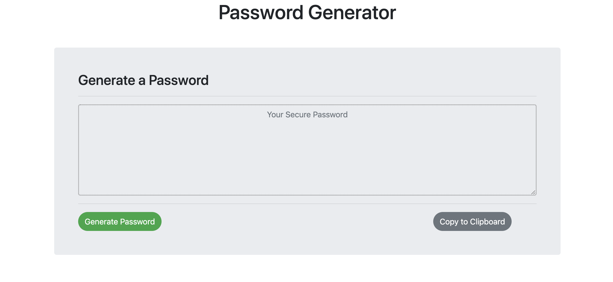

# Password-Generator

## Website URL:  https://sushmakaluva.github.io/Password-Generator/

### Description

* This Password Generator is a tool that generates strong and unpredictable passwords that are impossible to crack for each of our accounts.

### How does it work?
 
* The user on clicking 'Generate password' asks for a Password length that he would like to choose.
* Then the user is asked to choose criteria from the different character types:

<<<<<<< HEAD
  * Special characters
  * Numeric characters
  * Lowercase characters
  * Uppercase characters
=======
* Special characters
* Numeric characters
* Lowercase characters
* Uppercase characters
>>>>>>> 7e103953701f3ed6d993cd590639afabf9701f44

* The application validates user input and ensures that at least one character type is selected.
* Once all prompts are answered, the user will be presented with a password matching the answered prompts.

### Technologies used to build this site

* HTML5  
* CSS
* Bootstrap
* Javascript

### Components used to build this portfolio:

+ Bootstrap components - contaniers,jumbotron,forms,textareas
+ Bootstrap grids - rows and columns 
+ Javascript functions
+ Random value generators
+ Alerts, Prompts, Confirms
+ Copy to clipboard function
+ Strings, Arrays, Loops

